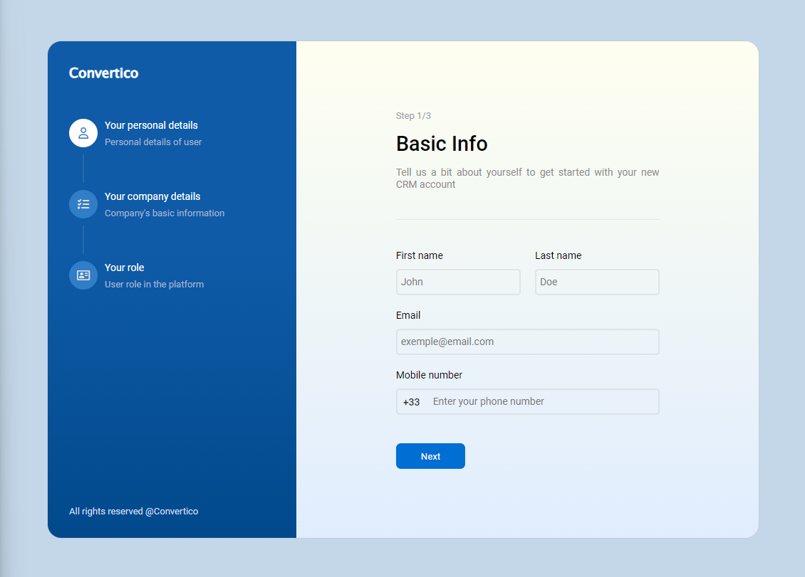

# Formulaire à 3 étapes

Ce projet est un petit challenge front-end que j'ai sélectionné sur Dribbble. Il s'agit d'un formulaire à 3 étapes réalisé en HTML, CSS et JavaScript.

## Fonctionnalités

- Formulaire multi-étapes
- Validation des champs
- Transitions fluides entre les étapes

## Technologies utilisées

- HTML
- CSS
- JavaScript

## Installation

1. Clonez le dépôt :
    ```bash
    git clone https://github.com/votre-utilisateur/form-3-steps.git
    ```
2. Ouvrez le fichier `index.html` dans votre navigateur.

## Aperçu

